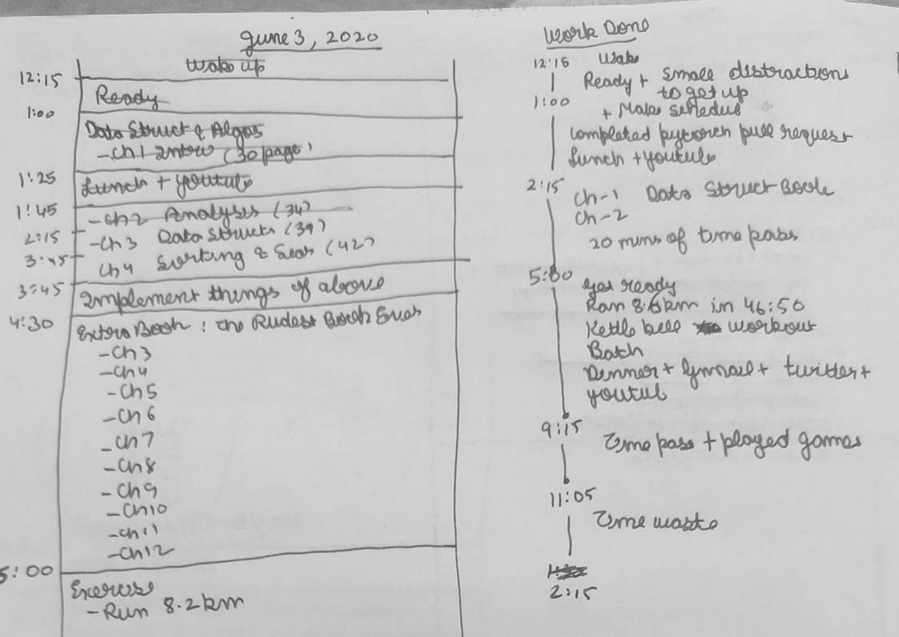

## June 2, 2020

Did not achieve much.

Completed all the small work that was preventing me from focusing on the main task
- organize study table
- make list of conference
- make a proper schedule to get work done (started this note taking also)

After today, I do not have any excuse preventing me from doing work. Everything is organized and taken care of. A new daily plan would be followed from tomorrow.

I will try a new strategy for making schedule tomorrow. Make schedule when I wake up and make it in 3 chunks (wake to lunch, lunch to exercise, exercise to sleep). Making schedule the previous day has some problems
- If I wake up late, the entire schedule is a waste
- Cannot adjust for tasks that were out of my control
- It did not take into account the fatigue from exercise from previous day

Let's see if this note-taking thing plays out. I have never tried to maintain a journal of myself before. 

Made [daily_organization_v1.md](day_organization_v1.md). The time limit I have set for myself is 2 weeks for this organization.

## June 3, 2020

Rating 4/10

Better than yesterday. It was a good step getting out of the comfort zone. Maybe it will take 2-3 days to get shit together.

The idea of scheduling the day as day goes along, went horribly bad. So from today I will go back to previous method of making the schedule the previous day, but making the schedule more generous in the sense that allot time for rest in between. So that if things go out of hand there is time on schedule for them.

I ran 8.5 km in 46:50 minutes. Easy run. Did kettlebell workout 20x, 25x, 30x both arms swings, single arm swings.

Overall I think this was a good day to get things working for tomorrow.

## June 4, 2020

